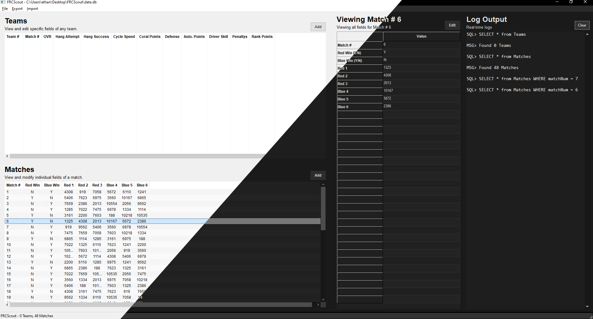

  <h1>FRCScout</h1>
  
<em>Empowering teams to make data-driven decisions and succeed together.</em>

  
  
  

A scouting application designed for FRC (FIRST Robotics Competition) teams to efficiently collect, analyze, and manage match and team performance data.

## Table of Contents
- [Features](#features)
- [Installation](#installation)
- [Usage](#usage)
- [Contributing](#contributing)
- [License](#license)
- [Contact](#contact)

## Features
- **📊 Data Collection**: Gather real-time match data on teams and robots.
- **🖥️ User-Friendly UI**: Simple and efficient interface built with wxWidgets.
- **🌐 Data Bass**: Store data locally using SQLite.
- **🤖 Machine Learning Predictions**: Uses Random Forest to predict match outcomes based on team performance data.
- **📤 QR Code Export**: Export team and match data as QR codes for quick data transfer.

## Installation
Download the latest release from the [Releases Page](https://github.com/provrb/frcscout/releases) and follow the instructions provided.

## Usage
1. Launch the application.
2. Input match data or import existing datasets.
3. Use machine learning predictions to strategize effectively.
4. Export reports for strategy planning.

## Contributing
Contributions are welcome! Feel free to open issues or submit pull requests to improve functionality or fix bugs.

## License
This project is licensed under the GPL 2.0 License. See the [LICENSE](LICENSE.txt) file for details.

## Contact
For inquiries or feature requests, open an issue on GitHub.

